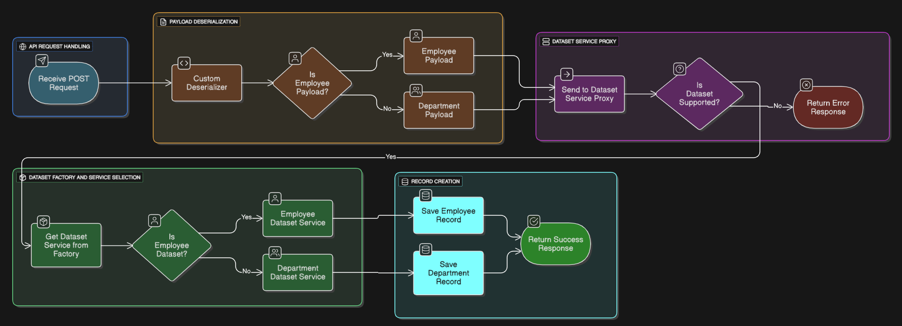
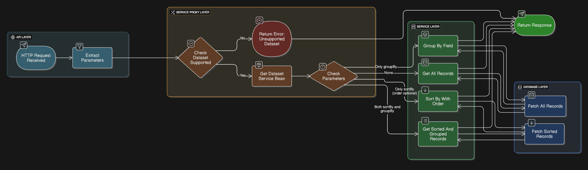
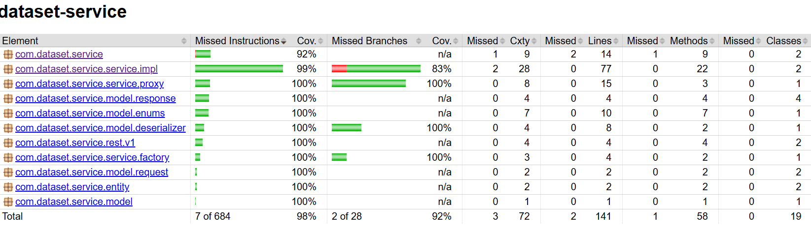

# Record SortBy and GroupBy API

This github repository is a spring boot microservice which has a couple of APIs for creating a record and performing searching and sorting operations on the records for a particular dataset.

**NOTE**
+ This microservice contains two apis, one for creating a record and other for sorting and grouping the records.
+ Both the APIs take datasetName in path and performs creation or sort and group operation accordingly for that dataset.

This microservice is built using these technologies
+ **JAVA 17**
+ **Spring boot 3.5.3**
+ **MySQL 8**
+ **Gradle 8.14.2**

**Create Record API FLOW DIAGRAM**

**SORT BY and GROUP API FLOW DIAGRAM**

🚀**How to run the API and test:**
+ Clone this repo
+ Required environment variables to start the application:
    + export your MySQL database host into MYSQL_DATABASE_HOST variable or else 'localhost' is considered default
    + export your MySQL database username into MYSQL_DATABASE_USER variable or else 'root' is considered default
    + export your MySQL database password into MYSQL_DATA_BASE_PASSWORD variable. Make sure you export this or else you
      won't be able to run the application.
    + Also make sure your localhost port 8080 is free, if not feel free to change the port of application by adding different value to server.port in application.properties or application.yml
    + That's it you will be able to run the application successfully.
+ you can access the swagger API documentation for this API using http://localhost:8080/swagger-ui/index.html, please note the port in swagger url might be different if you run application on different port.

**Code Coverage report generated using Jacoco**📄
